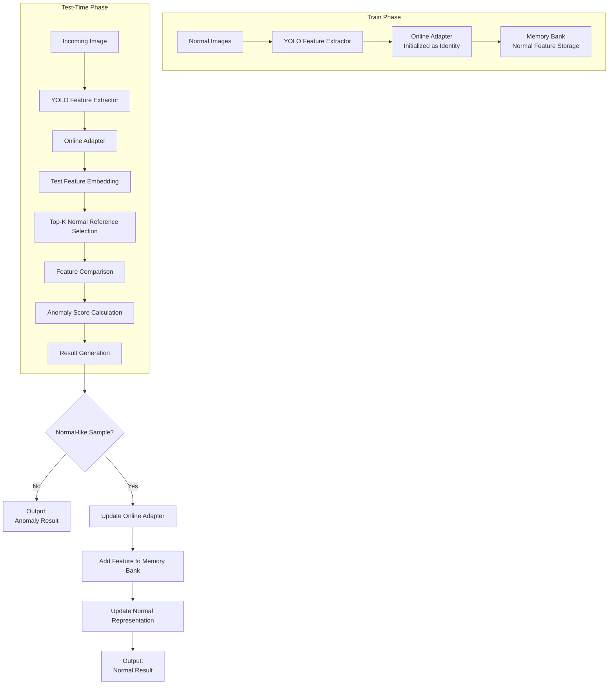

# Online-Test-Time-Learning-Method-for-Industrial-Defect-Detection-
Modern manufacturing requires defect detection systems that are efficient, adaptive and capable of identifying unknown defects. This research proposes an online test-time learning method using a YOLO26 nano classification model within an open-ended anomaly detection pipeline. A low-code platform is also developed to support easier implementation and practical use.

DATASET
--------
https://www.kaggle.com/code/ipythonx/mvtec-ad-anomaly-detection-with-anomalib-library/data
- Total of 5354 images (Train: 3629; Test: 1725). About 70:30 ratio. 
- Having 15 types material including
    - Hazelnut: 501
    - Screw: 439
    - Pill: 434
    - Carpet: 397
    - Grid: 385
    - Zipper: 379
    - Cable: 374
    - Wood: 362
    - Capsule: 351
    - Tile: 350
    - Leather: 337
    - Metal_nut: 313
    - Transistor: 313
    - Bottle: 292
    - Toothbrush: 102
 
CODE TEST FLOW
---------------
**TRAIN PHASE**

Normal Images -> YOLO Feature Extractor -> Online Adapter (initialized as identity) -> Memory Bank of Normal Features

**TEST-TIME PHASE**

Incoming Image -> YOLO Feature Extractor -> Online Adapter -> Test Feature Embedding -> Select Top-K Normal Reference Features from Memory Bank
-> Compare Test Feature with Normal Reference Features -> Calculate Anomaly Score 

-> Generate Result

    - Image-Level Result: Normal / Anomaly
    - Optional: Pixel-Level Anomaly Map

 -> Normal-like sample?

         -> No  -> Output anomaly result 
         -> Yes -> Online Adapter Update -> Add New Normal-like Feature to Memory Bank -> Updated Normal Representation -> Output Normal Result
            
## Code Test Flow

