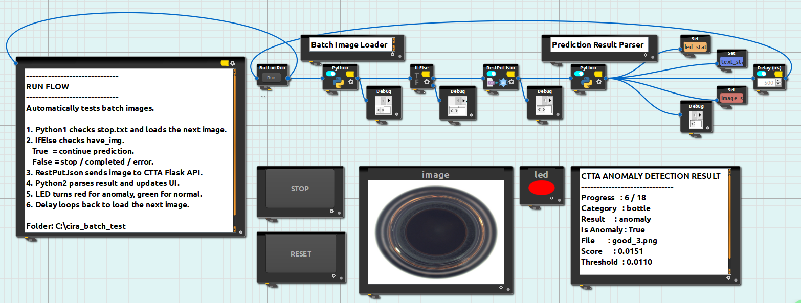
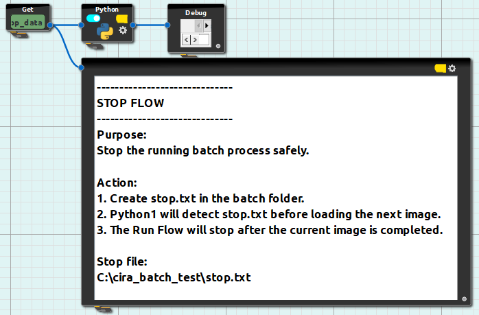
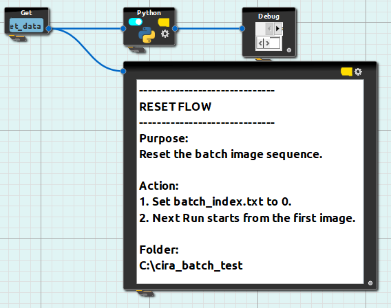
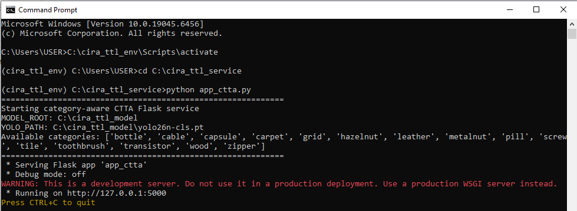

# Online-Test-Time-Learning-Method-for-Industrial-Defect-Detection-
Modern manufacturing requires defect detection systems that are efficient, adaptive and capable of identifying unknown defects. This research proposes an online test-time learning method for industrial defect detection using a frozen YOLO26 nano classification model, a normal memory bank, a lightweight adapter, and category-specific decision thresholds. The latest deployment supports automated batch image testing in CiRA CORE, where multiple category folders can be processed sequentially through a Flask API. The system displays the current image, prediction result, anomaly score, threshold and LED anomaly status, while also supporting Stop and Reset control flows.

## Table of Contents

- [1.0 Dataset](#10-dataset)
- [2.0 Project Workflow](#20-project-workflow)
  - [2.1 Project Purpose](#21-project-purpose)
  - [2.2 Article Review](#22-article-review)
    - [2.2.1 Key Implementation Ideas and Supporting References](#221-key-implementation-ideas-and-supporting-references)
  - [2.3 Proposed System Workflow](#23-proposed-system-workflow)
  - [2.4 Stage 1: Offline Preparation in Notebook](#24-stage-1-offline-preparation-in-notebook)
    - [2.4.1 Purpose](#241-purpose)
    - [2.4.2 Process Flow](#242-process-flow)
    - [2.4.3 Description](#243-description)
    - [2.4.4 Files in Use](#244-files-in-use)
    - [2.4.5 Exported Files](#245-exported-files)
    - [2.4.6 Model Performance by Category](#246-model-performance-by-category)
  - [2.5 Stage 2: Deployment Auto-Calibration](#25-stage-2-deployment-auto-calibration)
    - [2.5.1 Purpose](#251-purpose)
    - [2.5.2 Process Flow](#252-process-flow)
    - [2.5.3 Description](#253-description)
    - [2.5.4 Files in Use](#254-files-in-use)
    - [2.5.5 Output](#255-output)
  - [2.6 Stage 3: CiRA CORE + Flask CTTA Deployment Workflow](#26-stage-3-cira-core--flask-ctta-deployment-workflow)
    - [2.6.1 Purpose](#261-purpose)
    - [2.6.2 Process Flow](#262-process-flow)
    - [2.6.3 Description](#263-description)
    - [2.6.4 Files in Use](#264-files-in-use)
    - [2.6.5 Output](#265-output)
  - [2.7 CiRA CORE Workflow Design](#27-cira-core-workflow-design)
    - [2.7.1 Run Flow](#271-run-flow)
    - [2.7.2 Stop Flow](#272-stop-flow)
    - [2.7.3 Reset Flow](#273-reset-flow)
    - [2.7.4 Feature Nodes](#274-feature-nodes)
    - [2.7.5 CiRA CORE Operation](#275-cira-core-operation)

## 1.0 DATASET
https://www.kaggle.com/code/ipythonx/mvtec-ad-anomaly-detection-with-anomalib-library/data
- Total of 5354 images (Train: 3629; Test: 1725). About 70:30 ratio. 
- Having 15 types category including
    - Hazelnut: 501
    - Screw: 439
    - Pill: 434
    - Carpet: 397
    - Grid: 385
    - Zipper: 379
    - Cable: 374
    - Wood: 362
    - Capsule: 351
    - Tile: 350
    - Leather: 337
    - Metal_nut: 313
    - Transistor: 313
    - Bottle: 292
    - Toothbrush: 102

            
## 2.0 Project Workflow 

### 2.1 Project Purpose 

To develop a working online test-time learning method for industrial defect detection. The system is designed to identify abnormal product images by comparing incoming image features with stored normal reference features. Instead of retraining the entire model during deployment, this project uses a frozen YOLO26 feature extractor, a lightweight online adapter, a normal memory bank, and calibrated decision thresholds. This allows the system to keep the main feature extractor stable while still adapting to trusted normal images during testing. The project also connects the Python-based defect detection pipeline with Flask API and CiRA CORE. Through this integration, the system can display the current image, image number, total image count, category, prediction result, anomaly status, anomaly score, and threshold in a low-code workflow interface. 

### 2.2 Article Review 

Detail of article review in reserach/

#### 2.2.1 Key Implementation Ideas and Supporting References

Here the key implementation ideas used in this project and records the main references that support each technical decision. The project is built around industrial anomaly detection using a frozen YOLO26 feature extractor, normal feature memory bank, threshold-based anomaly decision, online test-time adaptation and CiRA CORE low-code deployment.

| Project Idea | Describe | Supporting Reference |
|---|---|---|
| Normal memory bank with reference embeddings | Normal training images are converted into feature embeddings and stored as a normal reference memory bank. During testing, the incoming image feature is compared with the stored normal features to calculate the anomaly score. | Roth et al. (2022), *Towards Total Recall in Industrial Anomaly Detection*. [arXiv](https://arxiv.org/abs/2106.08265) <br> Anomalib PatchCore Documentation. [Anomalib](https://anomalib.readthedocs.io/en/v2.0.0/markdown/guides/reference/models/image/patchcore.html) |
| Nearest-neighbor feature comparison | The test image embedding is compared with the closest normal reference embeddings. If the distance is large, the test image is considered more different from the normal pattern and may be classified as anomalous. | Roth et al. (2022), *Towards Total Recall in Industrial Anomaly Detection*. [arXiv](https://arxiv.org/abs/2106.08265) |
| Frozen/pre-trained feature extractor | A pre-trained model is used to extract visual features without retraining the full backbone. This reduces training cost and helps the system remain stable during deployment. | Heckler et al. (2023), *Exploring the Importance of Pretrained Feature Extractors for Unsupervised Anomaly Detection*. [CVF Open Access](https://openaccess.thecvf.com/content/CVPR2023W/VAND/papers/Heckler_Exploring_the_Importance_of_Pretrained_Feature_Extractors_for_Unsupervised_Anomaly_CVPRW_2023_paper.pdf) |
| YOLO26 as feature extractor | YOLO26 is selected as the visual feature extractor because YOLO-family models are generally suitable for fast and deployment-friendly visual inspection workflows. In this project, YOLO26 is used as a frozen feature extractor instead of a fully retrained supervised detector. | Mao et al. (2025), *YOLO Object Detection for Real-Time Fabric Defect Inspection in the Textile Industry: A Review of YOLOv1 to YOLOv11*. [MDPI Sensors](https://www.mdpi.com/1424-8220/25/7/2270) <br> Ultralytics YOLO26 Documentation. [Ultralytics](https://docs.ultralytics.com/models/yolo26/) |
| Lightweight online adapter | A small adapter layer is added after feature extraction. Instead of updating the entire YOLO26 model, only the lightweight adapter and selected normal reference information are used for online adaptation. | Wang et al. (2020), *TENT: Fully Test-Time Adaptation by Entropy Minimization*. [arXiv](https://arxiv.org/abs/2006.10726) <br> Wang et al. (2022), *CoTTA: Continual Test-Time Domain Adaptation*. [arXiv](https://arxiv.org/abs/2203.13591) |
| Threshold-based anomaly decision | The anomaly score is compared with a decision threshold to classify the image as normal or anomalous. The threshold is first calculated from normal validation scores and then adjusted using deployment-condition normal samples. | Costanzino et al. (2024), *Test Time Training for Industrial Anomaly Segmentation*. [arXiv](https://arxiv.org/abs/2404.03743) |
| Deployment auto-calibration | Trusted normal deployment images are used to recalibrate the anomaly threshold and update threshold. This helps reduce the difference between offline validation images and actual deployment images. | Costanzino et al. (2024), *Test Time Training for Industrial Anomaly Segmentation*. [arXiv](https://arxiv.org/abs/2404.03743) |
| Online test-time learning | The system adapts during testing by using incoming trusted normal-like samples. This is more suitable for changing industrial environments than full offline retraining, because lighting, camera angle, product surface, and image quality may change after deployment. | Wang et al. (2020), *TENT: Fully Test-Time Adaptation by Entropy Minimization*. [arXiv](https://arxiv.org/abs/2006.10726) <br> Wang et al. (2022), *CoTTA: Continual Test-Time Domain Adaptation*. [arXiv](https://arxiv.org/abs/2203.13591) |
| Real-world normal-reference anomaly comparison | Real industrial anomaly detection often needs comparison between test samples and normal reference samples, especially when defect types are unknown, subtle, or difficult to label. | Wang et al. (2025), *ReinAD: Towards Real-World Industrial Anomaly Detection with a Comprehensive Contrastive Dataset*. [OpenReview](https://openreview.net/forum?id=wEH5YGPSTx) |
| Low-code deployment workflow | The Python-based anomaly detection backend is connected to CiRA CORE through Flask API. This allows the user to trigger detection, display images, and view the category, result, anomaly status, score, and threshold in a low-code interface. | Loo (2024), *CiRA CORE: A Low Code Platform that Makes AI Work for Practical Application*. [Murdoch Research Portal](https://researchportal.murdoch.edu.au/esploro/outputs/conferenceProceeding/CiRA-CORE-A-Low-Code-Platform/991005743937807891) <br> Node-RED Official Website. [Node-RED](https://nodered.org/) |
| Limited labelled defect dataset is workable | Industrial anomaly detection does not always require a large labelled defect dataset because defective samples are often limited or unavailable in real production scenarios. The proposed test-time method follows this setting by using normal-reference learning and adapting during testing. Incoming image features can be compared with stored normal references, while test-time training research further supports adaptation during inference without full retraining on a large labelled defect dataset. | M-3LAB, *Awesome Industrial Anomaly Detection*. [GitHub](https://github.com/M-3LAB/awesome-industrial-anomaly-detection). <br> Zhang et al. (2024), *Test Time Training for Industrial Anomaly Segmentation*. [arXiv](https://arxiv.org/abs/2404.03743). |

Based on the references above, this project adopts a memory bank-based anomaly detection direction supported by online test-time learning. YOLO26 is used as a frozen feature extractor to generate image embeddings, while the normal memory bank and calibrated thresholds are used to determine whether an incoming image is normal or anomalous. The selected design avoids full model retraining during deployment and supports a practical low-code workflow through Flask API and CiRA CORE.

However, the selected method also has a limitation. If an abnormal image is wrongly treated as normal and added into the memory bank, the normal reference representation may become contaminated. Therefore, online updating should only be performed when the image is confidently normal or verified as a trusted normal sample.

### 2.3 Proposed System Workflow

The proposed system is arranged into three main stages:

<pre>
Stage 1: Offline Preparation in Notebook
        ↓
Stage 2: Deployment Auto-Calibration
        ↓
Stage 3: CiRA CORE + Flask CTTA Deployment Workflow
</pre>

| Stage | Name | Main Usage |
|---|---|---|
| Stage&nbsp;1 | Offline Preparation in Notebook | Prepare the initial normal representation and export model files |
| Stage&nbsp;2 | Deployment Auto-Calibration | Adjust the anomaly and update thresholds using trusted normal deployment images |
| Stage&nbsp;3 | CiRA CORE + Flask CTTA Deployment Workflow | Run the defect detection system through CiRA CORE and Flask API |


## 2.4 Stage 1: Offline Preparation in Notebook

### 2.4.1 Purpose

Prepare the initial normal representation and model files before deployment.

### 2.4.2 Process Flow

<pre>
MVTec AD train/good images
        ↓
Image preprocessing
        ↓
Frozen YOLO26 feature extraction
        ↓
Online adapter with identity initialization
        ↓
Build normal memory bank
        ↓
Use validation normal scores to calculate initial threshold
        ↓
Export deployment files:
    - yolo26n-cls.pt
    - ttl_adapter.pt
    - memory_bank.pt
    - threshold.json
</pre>

### 2.4.3 Description

The offline preparation from notebook here is to develop and prepare the initial anomaly detection model before deployment. A YOLO-based model is used as a frozen feature extractor, only a small adapter layer and the stored normal reference features are updated during online testing. This makes the system more stable and avoids the risk of changing the entire model during deployment.

Normal training images are passed through the YOLO feature extractor to obtain visual feature embeddings and these embeddings are stored in a normal memory bank as reference patterns of normal products. During validation, normal validation images are compared with this memory bank to calculate a distribution of normal anomaly scores. The initial anomaly threshold is then calculated from this normal-score distribution rather than being directly predicted by the model. 
End of this stage, four deployment files are generated and saved for later testing and deployment. 

### 2.4.4 Files in use

| File | Usage |
|---|---|
| `train_rev1.3.ipynb` | Dataset preparation, feature extraction, memory bank construction, initial threshold calibration, evalution and export of model files |

### 2.4.5 Exported Files

| File / Folder | Usage |
|---|---|
| `yolo26n-cls.pt` | Shared frozen YOLO26 feature extractor used for all categories. |
| `<category>/memory_bank.pt` | Stores the normal reference feature embeddings for each product category. |
| `<category>/ttl_adapter.pt` | Stores the lightweight adapter for each category. |
| `<category>/threshold.json` | Stores the category-specific anomaly threshold, update threshold, and related decision settings. |

Each deployed category has its own `memory_bank.pt`, `ttl_adapter.pt`, and `threshold.json`. This allows the Flask service to load the correct model files based on the category name received from CiRA CORE.

### 2.4.6 Model Performance by Category

Here the summarizes of evaluation result for each deployed category.

#### Model Performance by Category

| Rank | Category | Test Total | Threshold | Overall Accuracy | Normal Accuracy / Recall | Abnormal Accuracy / Recall | Normal Precision | Abnormal Precision | Macro F1 | AUROC |
|---:|---|---:|---:|---:|---:|---:|---:|---:|---:|---:|
| 1 | `bottle` | 83 | 0.011006 | 95.18% | 95.00% | 95.24% | 86.36% | 98.36% | 93.63% | 98.49% |
| 2 | `hazelnut` | 110 | 0.031495 | 90.91% | 77.50% | 98.57% | 96.88% | 88.46% | 89.68% | 98.25% |
| 3 | `tile` | 117 | 0.016451 | 88.89% | 81.82% | 91.67% | 79.41% | 92.77% | 86.41% | 96.68% |
| 4 | `cable` | 150 | 0.023347 | 86.00% | 84.48% | 86.96% | 80.33% | 89.89% | 85.38% | 95.16% |
| 5 | `transistor` | 100 | 0.015753 | 83.00% | 96.67% | 62.50% | 79.45% | 92.59% | 80.92% | 87.96% |
| 6 | `metal_nut` | 115 | 0.014402 | 82.61% | 81.82% | 82.80% | 52.94% | 95.06% | 76.40% | 90.57% |
| 7 | `zipper` | 151 | 0.008115 | 81.46% | 75.00% | 83.19% | 54.55% | 92.52% | 75.38% | 88.76% |
| 8 | `wood` | 79 | 0.032310 | 81.01% | 57.89% | 88.33% | 61.11% | 86.89% | 73.53% | 91.49% |
| 9 | `screw` | 160 | 0.026497 | 78.12% | 21.95% | 97.48% | 75.00% | 78.38% | 60.43% | 88.75% |
| 10 | `grid` | 78 | 0.021676 | 76.92% | 52.38% | 85.96% | 57.89% | 83.05% | 69.74% | 72.10% |
| 11 | `toothbrush` | 42 | 0.018410 | 76.19% | 33.33% | 93.33% | 66.67% | 77.78% | 64.65% | 88.89% |
| 12 | `leather` | 124 | 0.006895 | 71.77% | 9.38% | 93.48% | 33.33% | 74.78% | 48.86% | 62.91% |
| 13 | `capsule` | 132 | 0.006881 | 71.21% | 78.26% | 69.72% | 35.29% | 93.83% | 64.32% | 84.04% |
| 14 | `carpet` | 117 | 0.005212 | 69.23% | 14.29% | 86.52% | 25.00% | 76.24% | 49.62% | 68.94% |
| 15 | `pill` | 167 | 0.011324 | 64.67% | 84.62% | 60.99% | 28.57% | 95.56% | 58.59% | 80.36% |

#### Important Evaluation Metrics

| Metric | Usage |
|---|---|
| `Overall Accuracy` | Measures the overall correct prediction rate across both normal and abnormal images. It is useful for quick comparison, but it can be misleading when the dataset is imbalanced. |
| `Normal Accuracy / Recall` | Measures how well the model correctly identifies normal images. A low value means many normal images are wrongly detected as anomalies, causing false alarms. |
| `Abnormal Accuracy / Recall` | Measures how well the model detects actual abnormal or defective images. This is one of the most important metrics for industrial defect detection because missing a defect is usually more critical than a false alarm. |
| `Normal Precision` | Measures how reliable the model is when it predicts an image as normal. |
| `Abnormal Precision` | Measures how reliable the model is when it predicts an image as abnormal. A low value means many normal images are incorrectly flagged as defects. |
| `Macro F1` | Provides a balanced score between the normal and abnormal classes. It is useful when the number of normal and abnormal images is uneven. |
| `AUROC` | Measures how well the anomaly score separates normal and abnormal images regardless of one fixed threshold. Higher AUROC means better separation between normal and defective samples. |
| `Threshold` | Defines the anomaly decision boundary for each category. If the anomaly score is higher than the threshold, the image is classified as abnormal. |

## 2.5 Stage 2: Deployment Auto-Calibration

### 2.5.1 Purpose

It involved 15 categories. Each category has its own threshold configuration because different product categories have different normal feature distributions and decision boundaries. During deployment, the Flask service loads the corresponding category folder based on the category name sent by CiRA CORE.

### 2.5.2 Process Flow

<pre>
Trusted normal deployment images
        ↓
score_only() calculates normal deployment scores
        ↓
Calculate anomaly_threshold from high normal-score quantile
        ↓
Calculate update_threshold from stricter normal-score quantile
        ↓
Update threshold.json automatically
</pre>

### 2.5.3 Description

Deployment auto-calibration is included to adjust the decision thresholds before the system is used in the CiRA CORE workflow. Although the notebook generates an initial threshold from validation normal images, the actual deployment images may have different lighting, image quality, background, capture angle or image source. Therefore, a small set of trusted normal images from the target deployment category is used to calculate a more suitable `anomaly_threshold` and `update_threshold`. 

The `score_only()` function calculates anomaly scores without updating the adapter or memory bank. These scores are then used to generate the `anomaly_threshold` and `update_threshold`. The `anomaly_threshold` is used to decide whether an image should be classified as normal or anomalous. The `update_threshold` is used to decide whether an image is confidently normal and suitable for online updating. After calibration, the updated threshold values are saved into `threshold.json`.

In the current implementation, about 5 normal bottle images from the testing folder are selected and treated as deployment-condition normal samples for demonstration. The bottle category is used as the example category in this stage. If additional categories are deployed in the future, the same calibration process should be repeated separately for each category because each product category has its own normal feature distribution and decision boundary.

### 2.5.4 Files in use

| File | Usage |
|---|---|
| `auto_calibrate_threshold.py` | Deployment threshold calibration. Calibrated anomaly threshold and update threshold. Trusted normal deployment images used to calibrate threshold under testing folder stored in `workdir\cira_ttl_calibration` |

### 2.5.5 Output

| Output File | Usage |
|---|---|
| `threshold.json` | Stores the updated `anomaly_threshold`, `update_threshold` and calibration settings for deployment |


## 2.6 Stage 3: CiRA CORE + Flask CTTA Deployment Workflow

### 2.6.1 Purpose

Run the defect detection system through a low-code workflow.

### 2.6.2 Process Flow

<pre>
Run ButtonRun
        ↓
Batch Image Loader
        ↓
Check stop.txt and batch_index.txt
        ↓
Load next valid image from category folder
        ↓
IfElse checks have_img
        ↓
RestPutJson sends image_path, category, and mode to Flask CTTA API
        ↓
Flask loads category-specific model files
        ↓
CTTA detector extracts YOLO26 features and compares with memory bank
        ↓
Calculate anomaly score and apply threshold decision
        ↓
Prediction Result Parser prepares UI outputs
        ↓
Set(text_status), Set(led_status), Set(image_status)
        ↓
Display result, LED status, and current image
        ↓
Delay loops back to process the next image
</pre>

###  2.6.3 Description

In this stage, the anomaly detection workflow is deployed through CiRA CORE and a Flask CTTA service. CiRA CORE acts as the low-code interface, while Flask serves as the bridge to the Python-based CTTA detector.

The latest CiRA CORE workflow supports automated batch testing. Images are stored under `C:\cira_batch_test` using category subfolders, such as `bottle`, `hazelnut`, `tile`, and other supported MVTec AD categories. The `Batch Image Loader` reads `batch_index.txt`, loads the next valid image, infers the category from the folder name, and sends `image_path`, `category`, and `mode` to the Flask `/predict` endpoint through `RestPutJson`.

The Flask service loads the corresponding category-specific files from `C:\cira_ttl_model\<category>`, including `memory_bank.pt`, `ttl_adapter.pt`, and `threshold.json`. The CTTA detector extracts YOLO26 visual features, compares them with the normal memory bank, calculates the anomaly score, and returns the prediction result to CiRA CORE.

The `Prediction Result Parser` formats the result for UI display. The Text block shows image progress, category, result, anomaly status, score, and threshold. The LED turns red for anomaly and green for normal. The Image block displays the current analyzed image. A Delay block then loops back to process the next image automatically until all images are completed or a stop request is detected.

### 2.6.4 Files in use

| File | Usage |
|---|---|
| `app_ctta.py` | Category-aware Flask service file. It receives `image_path`, `category`, and `mode` from CiRA CORE, loads the corresponding category model files, runs prediction through the CTTA detector, and returns the JSON result to CiRA CORE. It supports `evaluate`, `monitor`, and `calibrate` modes. |
| `cira_ttl_anomaly.py` | Core CTTA detector file. It handles YOLO26 feature extraction, adapter processing, normal memory bank comparison, anomaly score calculation, threshold decision, and optional online update. |
| `auto_calibrate_threshold.py` | Optional deployment calibration script used to adjust anomaly and update thresholds using trusted normal deployment images. |

### 2.6.4.1 Deployment Folder Structure

```text
**C:\cira_ttl_model**
│
├── yolo26n-cls.pt
│
├── bottle
│   ├── memory_bank.pt
│   ├── ttl_adapter.pt
│   └── threshold.json
│
├── hazelnut
│   ├── memory_bank.pt
│   ├── ttl_adapter.pt
│   └── threshold.json
│
├── tile
│   ├── memory_bank.pt
│   ├── ttl_adapter.pt
│   └── threshold.json
│
└── ...

**C:\cira_batch_test**
│
├── bottle
│   ├── good_1.png
│   └── bad_1.png
│
├── hazelnut
│   ├── good_1.png
│   └── bad_1.png
│
├── tile
│   ├── good_1.png
│   └── bad_1.png
│
├── batch_index.txt
└── stop.txt <Created when triggered by STOP button>

**C:\cira_ttl_service**
│
├── app_ctta.py
└── auto_calibrate_threshold.py
```

### 2.6.5 Output

| Output | Usage |
|---|---|
| JSON prediction result | Returned from the Flask API to CiRA CORE for each image. |
| Text display | Shows image progress, category, result, anomaly status, file name, anomaly score, and threshold. |
| LED display | Shows anomaly status visually. Red indicates anomaly; green indicates normal. |
| Image display | Shows the current image being analyzed. |
| `batch_index.txt` | Stores the current image index so the Run Flow can continue to the next image. |
| `stop.txt` | Created by the Stop Flow to request the Run Flow to stop after the current image. |
| `prediction_log.csv` | Stores prediction history, including image path, score, label, update status, and memory size if logging is enabled. |
| `memory_bank_update_*.pt` | Saves updated memory bank checkpoints when online update is enabled. |

### 2.7 CiRA CORE Workflown Design

In CiRA CORE, the low-code deployment is built with three supporting flows:

1. **Run Flow** – automatically loads batch images, sends them to the Flask API, displays results, and loops to the next image.
2. **Stop Flow** – creates `stop.txt` to request the Run Flow to stop safely after the current image.
3. **Reset Flow** – resets `batch_index.txt` to `0` so the next Run Flow starts from the first image.

#### 2.7.1 Run Flow



#### 2.7.2 Stop Flow



#### 2.7.3 Reset Flow



#### 2.7.4 Feature Nodes

| Feature Node | Usage in This Workflow |
|---|---|
| `Button Run` | Used as the main execution trigger for each workflow.<br><br>**Real case:** The Run `Button Run` starts the batch image testing loop. The Stop `Button Run` triggers `Stop File Gen`. The Reset `Button Run` triggers `Batch Index Reset`. |
| `Batch Image Loader` | Python node used to control the batch image input process.<br><br>**Real case:** It checks `stop.txt`, reads `batch_index.txt`, loads the next valid image from `C:\cira_batch_test`, and prepares `image_path`, `category`, and `mode` for Flask prediction. |
| `Prediction Result Parser` | Python node used to process the prediction result and prepare UI output.<br><br>**Real case:** It parses the CTTA Flask API response, extracts the prediction result, anomaly score, threshold, and image information, then prepares `display_text`, `led_color`, and the current image object for UI display. |
| `Batch Index Reset` | Python node used to reset the batch image sequence.<br><br>**Real case:** It resets `batch_index.txt` to `0`, allowing the next Run Flow to restart from the first image. |
| `Stop File Gen` | Python node used to request a safe stop for the Run Flow.<br><br>**Real case:** It creates `stop.txt` in `C:\cira_batch_test`. The Run Flow will detect this file before loading the next image and stop after the current image is completed. |
| `Debug` | Used to monitor internal payloads and troubleshoot the workflow.<br><br>**Real case:** It verifies image loading, Flask API responses, prediction results, stop requests, reset status, and UI output values. |
| `IfElse` | Used to decide whether the Run Flow should continue.<br><br>**Real case:** If `have_img = true`, the image is sent to the Flask API for prediction. If `have_img = false`, the workflow stops because the batch is completed, stopped, or has an error. |
| `RestPutJson` | Used to send image information to the CTTA Flask API.<br><br>**Real case:** It sends `image_path`, `category`, and `mode` to the Flask `/predict` endpoint and receives the anomaly prediction result. |
| `Set` | Used to publish Python output to selected UI display channels.<br><br>**Real case:** `Set(text_status)` updates the result Text display, `Set(led_status)` updates the LED anomaly status, and `Set(image_status)` updates the current image display. |
| `Get` | Used to retrieve selected flow data when required.<br><br>**Real case:** It is mainly used for testing or retrieving UI-related data. The main Run / Stop / Reset execution is controlled by `Button Run` for stability. |
| `Delay` | Used to control the interval before the next image is loaded.<br><br>**Real case:** After each prediction is completed and the UI is updated, the Delay block triggers the Run Flow again to process the next image automatically. |
| `Text` | Used to display the parsed prediction result.<br><br>**Real case:** It displays progress, category, result, anomaly status, file name, anomaly score, and threshold through `Set(text_status)`. |
| `Label` | Used as a static explanation block on the CiRA CORE canvas.<br><br>**Real case:** It describes the purpose and logic of the Run Flow, Stop Flow, and Reset Flow for better readability. |
| `LED` | Used to show anomaly status visually.<br><br>**Real case:** It receives data through `Set(led_status)`. The LED turns red when an anomaly is detected and green when the image is classified as normal. |
| `Image` | Used to display the current image being analyzed.<br><br>**Real case:** It receives the actual image object through `Set(image_status)`, allowing the UI to show the image processed in the current prediction cycle. |

#### 2.7.4 CiRA CORE Operation

1. Start the Flask CTTA service.

```bash
C:\cira_ttl_env\Scripts\activate
cd C:\cira_ttl_service
python app_ctta.py
```


2. Prepare batch images under C:\cira_batch_test using category subfolders.
3. Click `Reset` in CiRA CORE to set batch_index.txt to 0.
4. Click `Run` to start automated batch prediction.
5. The UI will show:
    - current image
    - progress
    - category
    - prediction result
    - anomaly score
    - threshold
    - LED anomaly status
6. Click `Stop` to create stop.txt. The Run Flow will stop after the current image is completed.


