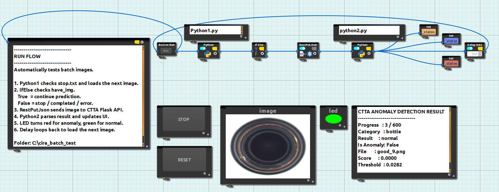
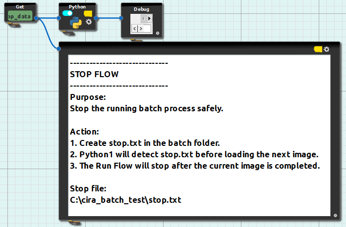
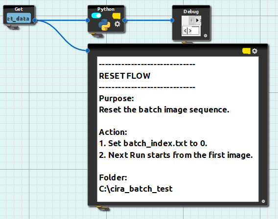

# Online Test-Time Learning Method for Industrial Defect Detection

This repository presents the development of an industrial anomaly-detection system that starts from an **offline normal-reference model** and progressively evolves into a **local patch-based continual test-time adaptation (CTTA) workflow**.

The complete project uses a **frozen YOLO26n classification backbone**, category-specific normal reference memory, deployment calibration, local patch representation, safe online adaptation, Flask API integration, and CiRA CORE low-code operation.

The project did not begin directly with the final local-patch method. The research first established a complete offline-to-deployment workflow using global image-level features, category-specific normal memory and thresholds. After the basic system was stable across all 15 MVTec AD categories, later experiments investigated the representation limitation of global features and moved the project toward local patch memory.

> **Final recommendation:** use **Memory CTTA** as the default deployment mode. It achieved the best overall Accuracy and Macro F1 in the final ablation while keeping the frozen YOLO26 backbone and PatchAdapter parameters unchanged.

---

## Table of Contents

- [1. Project Overview](#1-project-overview)
- [2. Research Objectives](#2-research-objectives)
- [3. Dataset](#3-dataset)
- [4. Complete Project Development Flow](#4-complete-project-development-flow)
  - [4.1 Stage 1 - Offline Normal-Reference Preparation](#41-stage-1---offline-normal-reference-preparation)
  - [4.2 Stage 2 - Deployment Calibration](#42-stage-2---deployment-calibration)
  - [4.3 Stage 3 - Global-to-Local Representation Development](#43-stage-3---global-to-local-representation-development)
  - [4.4 Stage 4 - Safe Continual Test-Time Adaptation](#44-stage-4---safe-continual-test-time-adaptation)
  - [4.5 Stage 5 - Flask and CiRA CORE Deployment](#45-stage---5-flask-and-cira-core-deployment)
- [5. Final Method](#5-final-method)
- [6. Experimental Development](#6-experimental-development)
- [7. Final Results](#7-final-results)
- [8. Deployment and CiRA CORE Operation](#8-deployment-and-cira-core-operation)
- [9. Main Findings](#9-main-findings)
- [10. Limitations](#10-limitations)
- [11. Technical Detail](#11-technical-detail)

---

# 1. Project Overview

Industrial anomaly detection often has many normal samples but limited examples of future defects. A static model may also become less reliable when lighting, camera position, product appearance or other production conditions change after deployment.

This project therefore investigates a normal-reference detector that can operate without retraining the full backbone.

More Literature Review at [`research/README.md`](code/README.md)

Core related info at [`code/README.md`](code/README.md)

The complete system contains:

| Component | Project usage |
|---|---|
| **YOLO26n-cls** | Frozen visual feature extractor used throughout the project. |
| **Normal reference memory** | Stores features from normal products and provides the reference for anomaly scoring. |
| **Category-specific thresholds** | Keeps a different decision boundary for each MVTec AD category. |
| **Local patch features** | Preserves small local defect information that may be lost in a global image embedding. |
| **Trusted-normal calibration** | Adjusts deployment thresholds using normal samples from the deployment condition. |
| **Safe update gate** | Allows adaptation only for samples that are sufficiently normal-like and consistent. |
| **PatchAdapter** | Lightweight feature transformation used for parameter-adaptation experiments. |
| **Memory CTTA** | Updates the category normal patch memory during deployment. |
| **Flask** | Exposes the Python detector through `/predict`. |
| **CiRA CORE** | Provides Run, Stop, Reset, image display, result display and batch control through a low-code workflow. |

The main development path is:

```text
Offline global normal-reference model
        ↓
Category-specific deployment files
        ↓
All-category validation
        ↓
Global representation baseline
        ↓
Local patch representation
        ↓
Patch-configuration tuning
        ↓
Trusted-normal deployment calibration
        ↓
Safe update gate
        ↓
Memory / Adapter / Full CTTA comparison
        ↓
Flask API
        ↓
CiRA CORE low-code deployment
```

---

# 2. Research Objectives

The project is guided by the following research objectives:

1. **Develop a normal-reference industrial anomaly-detection method** using a frozen YOLO26 feature extractor and category-specific local patch memory.

2. **Establish category-specific deployment thresholds** using trusted normal images so the detector can adjust its operating boundary to deployment conditions.

3. **Implement controlled online adaptation** while keeping the YOLO26 backbone frozen and allowing only selected lightweight state to change during deployment.

4. **Separate the contribution of each deployment component** by comparing threshold calibration, normal-memory adaptation, PatchAdapter adaptation and their combination.

5. **Evaluate robustness under sequential test-time conditions** using shuffled image streams and metrics including Accuracy, Normal Recall, Anomaly Recall, Macro F1, AUROC and online-update quality.

6. **Integrate the final detector with Flask and CiRA CORE** to provide low-code batch operation, image processing, prediction display, Run/Stop/Reset control and logging.

These objectives connect the full project path: the work begins with offline normal-reference preparation, improves the feature representation through local patches, introduces deployment calibration and safe CTTA, and finally validates the method through a low-code deployment prototype.

---

# 3. Dataset

The project uses **MVTec AD**, containing more than 5,000 industrial images across 15 object and texture categories.

```text
bottle
cable
capsule
carpet
grid
hazelnut
leather
metal_nut
pill
screw
tile
toothbrush
transistor
wood
zipper
```

Normal training images are used to construct the initial normal reference.

Defective samples are used for evaluation and are not required to construct the initial normal memory.

---

# 4. Complete Project Development Flow

## 4.1 Stage 1 - Offline Normal-Reference Preparation

The first stage of the project was to establish a complete normal-reference anomaly-detection workflow before introducing the later local-patch CTTA method.

The initial offline workflow was:

```text
MVTec AD train/good images
        ↓
Image preprocessing
        ↓
Frozen YOLO26 feature extraction
        ↓
Global image feature representation
        ↓
Identity-initialized lightweight adapter
        ↓
Category normal-reference memory
        ↓
Normal validation scoring
        ↓
Category-specific threshold
        ↓
Export deployment state
```

The purpose of this stage was not to train YOLO26 as a defect classifier. Instead, YOLO26 was used as a fixed feature extractor.

The system learned **normality** by storing normal image features. During testing, an incoming image was compared with stored normal references. A larger distance from the normal reference produced stronger anomaly evidence.

Each category kept separate deployment information so that different product categories could have different normal feature distributions and decision boundaries.

The early deployment state included:

```text
yolo26n-cls.pt
<category>/memory_bank.pt
<category>/ttl_adapter.pt
<category>/threshold.json
```

This initial workflow established:

- normal-reference anomaly direction;
- deployment export and loading;
- category-specific state;
- automatic threshold handling;
- all-category testing;
- the initial Flask/CiRA deployment path.

The rev1.0–rev1.5 stages therefore remain part of the project rather than being treated as discarded work.

---

## 4.2 Stage 2 - Deployment Calibration

The offline threshold is calculated from the original dataset, but deployment images may have different lighting, camera position, background, image quality or other appearance changes.

To reduce this mismatch, the system performs trusted-normal calibration before the final deployment test.

```text
Trusted normal deployment images
        ↓
score_only()
        ↓
normal deployment-score distribution
        ↓
anomaly threshold
+
update threshold
```

The final system uses **20 trusted-normal images per category**.

Anomaly threshold:

```math
T_{anom}
=
Q_{0.995}(S_{normal})
+
0.10\sigma
```

Update threshold:

```math
T_{update}
=
Q_{0.90}(S_{normal})
```

with:

```math
T_{update} \le T_{anom}
```

This creates two operating regions:

```text
score < T_update
→ normal
→ may be considered for adaptation

T_update ≤ score < T_anom
→ normal
→ prediction only, no update

score ≥ T_anom
→ anomaly
→ no update
```

Calibration alone produced the largest deployment-level gain in the final ablation:

```text
Baseline Accuracy     = 79.50%
Calibration Accuracy  = 84.17%

Gain = +4.67 percentage points
```

---

## 4.3 Stage 3 - Global-to-Local Representation Development

After the initial workflow was stable, the next question was whether one global image feature was sufficient for industrial anomaly detection.

### Global representation - rev1.6

The rev1.6 system represented the complete image using a global YOLO feature.

```text
Mean AUROC ≈ 84.84%
```

This worked as a baseline, but small scratches, holes, texture changes or missing local regions could be diluted when the full image was compressed into one vector.

### Local patch representation - rev1.7

The detector was then changed to use local intermediate YOLO features.

```text
Frozen YOLO26
      ↓
Intermediate feature maps
      ↓
Local patch descriptors
      ↓
Nearest-normal patch comparison
```

This increased mean AUROC to:

```text
93.02%
```

Improvement:

```math
93.02 - 84.84 = 8.18
```

The result showed that keeping local spatial information was much more effective for small industrial defects.

### Patch configuration - rev1.8

The project then tested 108 candidate combinations:

```text
Image size     : 224 / 384 / 512
Feature depth  : last1 / last2 / last3
Patch grid     : 8 / 14 / 20
Top fraction   : 1% / 3% / 5% / 10%
```

Final selected configuration:

```text
img_size           = 384
feature_choice     = last2
patch_grid         = 14
patch_top_fraction = 0.05
max_patch_memory   = 16000
```

Final offline representation result:

| Metric | Result |
|---|---:|
| Mean AUROC | **94.49%** |
| Accuracy | **82.36%** |
| Normal Recall | **84.59%** |
| Anomaly Recall | **80.86%** |
| Macro F1 | **78.42%** |

After rev1.8, this representation was frozen and the later experiments focused on deployment adaptation.

---

## 4.4 Stage 4 - Safe Continual Test-Time Adaptation

Continual test-time adaptation means that selected system state may change while test images arrive sequentially.

The YOLO26 backbone remains frozen.

Three adaptation modes were investigated:

```text
Memory CTTA
→ update normal patch memory only

Adapter CTTA
→ update PatchAdapter only

Full CTTA
→ update both
```

### Safe update gate

The main risk is memory or parameter contamination if an anomalous sample is incorrectly accepted as normal.

The update rule therefore uses both a score condition and a consistency condition:

```math
G_{update}
=
G_{score}
\land
G_{cons}
```

Score gate:

```math
G_{score}
=
[S(x) < T_{update}]
```

Consistency gate:

```math
G_{cons}
=
[E_{cons} < T_{cons}]
```

The q0.90 update boundary was selected after comparison with q0.95.

| Metric | q0.95 | q0.90 |
|---|---:|---:|
| Accuracy | 88.33% | 88.00% |
| Anomaly Recall | 91.00% | **91.00%** |
| Bad Updates | 12 | **8** |
| Update Precision | 94.78% | **96.10%** |

The stricter q0.90 gate reduced bad updates by approximately 33.3% without reducing anomaly recall.

---

## 4.5 Stage 5 - Flask and CiRA CORE Deployment

The final detector is separated into two layers:

```text
Python / Flask
→ model logic, scoring, calibration, CTTA and logging

CiRA CORE
→ operator workflow, batch sequence and result display
```

Main runtime flow:

```text
Run
 ↓
python1.py
 ↓
Load next image and category
 ↓
Flask /predict
 ↓
cira_ttl_anomaly.py
 ↓
Prediction + score + threshold + CTTA diagnostics
 ↓
python2.py
 ↓
Text + LED + image display
 ↓
Next image
```

`python1.py` handles the input side of the batch process.

`python2.py` processes the returned JSON result and prepares the values displayed in CiRA CORE.

Stop and Reset are implemented separately so the batch can be controlled without mixing these functions into the detection logic.

---

# 5. Final Method

The final deployment design is:

```text
Frozen YOLO26n
        ↓
384 × 384 input
        ↓
last2 intermediate features
        ↓
14 × 14 local patch grid
        ↓
Nearest-normal cosine distance
        ↓
Top-5% patch anomaly score
        ↓
Trusted-normal calibrated thresholds
        ↓
q0.90 score gate + consistency gate
        ↓
Memory CTTA
```

PatchAdapter remains in the repository for comparison and future research, but it is not enabled in the recommended default mode.

---

# 6. Experimental Development

| Revision | Main purpose | Main result |
|---|---|---|
| rev1.0 | First test-time workflow | Basic end-to-end path established |
| rev1.1 | Normal-reference anomaly direction | Higher distance defined as stronger anomaly evidence |
| rev1.2 | Export and loading | Category state reusable outside notebook |
| rev1.3 | Automatic calibration | Repeatable normal-only threshold estimation |
| rev1.4 | All-category expansion | Overall category accuracy improved from about 62.53% to 79.81% |
| rev1.5 | Code and experiment cleanup | Stable base for later experiments |
| rev1.6 | Global YOLO representation | 84.84% mean AUROC |
| rev1.7 | Local patch representation | 93.02% mean AUROC |
| rev1.8 | Patch ablation | 94.49% mean AUROC |
| rev1.9 | Adapter verification | 234/234 accepted samples updated adapter |
| rev1.10 | Safe update gate | Bad updates reduced from 12 to 8 |
| rev1.11 | Shuffled-stream robustness | Stable detection across seeds 42, 130 and 2030 |
| rev1.12 | Final ablation | Memory CTTA selected as final deployment mode |

Detailed revision-by-revision results are kept in the code documentation and `code/result/rev1.8` through `code/result/rev1.12`.

---

# 7. Final Results

Five methods were compared in the final ablation:

| Method | Accuracy | Normal Recall | Anomaly Recall | Macro F1 | Category AUROC |
|---|---:|---:|---:|---:|---:|
| Baseline | 79.50% | 71.33% | 87.67% | 79.36% | 94.70% |
| Calibration | 84.17% | 77.33% | **91.00%** | 84.09% | 94.70% |
| **Memory CTTA** | **85.22% ± 0.42%** | 80.67% ± 1.20% | 89.78% ± 0.38% | **85.19% ± 0.43%** | 93.11% ± 0.05% |
| Adapter CTTA | 84.11% ± 0.10% | 77.22% ± 0.19% | **91.00% ± 0.00%** | 84.04% ± 0.10% | 94.70% ± 0.02% |
| Full CTTA | 85.17% ± 0.44% | **81.00% ± 1.33%** | 89.33% ± 0.88% | 85.14% ± 0.45% | 93.14% ± 0.18% |

The result does not show that the most complex configuration is automatically the best.

```text
Largest deployment gain
→ Calibration

Strongest online contribution
→ Memory adaptation

Best overall Accuracy and Macro F1
→ Memory CTTA

Best Normal Recall
→ Full CTTA
```

Final recommended mode:

```text
EXPERIMENT = "memory_ctta"
```

---

# 8. Deployment and CiRA CORE Operation

## 8.1 Folder Setup

```text
C:\cira_ttl_model\
├── yolo26n-cls.pt
├── cira_ttl_anomaly.py
└── <category>\
    ├── patch_memory_bank.pt
    └── threshold.json

C:\cira_ttl_service\
└── app_ctta.py

C:\cira_batch_test\
├── batch_index.txt
└── <category>\
    ├── good_*.png
    └── bad_*.png
```

## 8.2 Start Flask

```bat
C:\cira_ttl_env\Scripts\activate
cd /d C:\cira_ttl_service
python app_ctta.py
```

Default deployment mode:

```python
EXPERIMENT = "memory_ctta"
```

Flask endpoint:

```text
http://127.0.0.1:5000
```

## 8.3 CiRA CORE Run Flow and Low-Code Prototype

The Run flow controls sequential batch inference. `python1.py` selects the current image and category, Flask performs anomaly detection and CTTA processing, and `python2.py` prepares the returned result for display.



## 8.4 CiRA CORE Stop Flow

The Stop flow creates the stop condition used by the running batch. The current prediction can finish before the next image is blocked.



## 8.5 CiRA CORE Reset Flow

The Reset flow clears the batch-control state and prepares the workflow for a clean restart.



## 8.6 Runtime Sequence

```text
Run
 ↓
python1.py
 ↓
check stop state
 ↓
read batch index
 ↓
load image + category
 ↓
REST request to Flask
 ↓
app_ctta.py
 ↓
cira_ttl_anomaly.py
 ↓
score + prediction
 ↓
safe update decision
 ↓
optional online update
 ↓
CSV diagnostics
 ↓
JSON response
 ↓
python2.py
 ↓
image + result + score + threshold + LED
 ↓
next image
```

LED status:

```text
GREEN = normal
RED   = anomaly
GRAY  = error
```

---

# 9. Main Findings

The main findings of the complete project are:

1. The early offline stages were necessary to establish a stable normal-reference and deployment workflow before the later CTTA experiments.
2. Replacing the global image feature with local patch features produced the largest representation-level improvement, increasing mean AUROC from approximately 84.84% to 93.02%.
3. The final tuned patch configuration reached 94.49% mean AUROC.
4. Trusted-normal calibration produced the largest deployment-level accuracy gain: 79.50% to 84.17%.
5. The q0.90 update gate reduced defective online updates while maintaining anomaly recall.
6. Memory adaptation provided the strongest useful CTTA contribution.
7. PatchAdapter learning was technically verified, but its standalone performance contribution was limited.
8. Full CTTA achieved the best normal recall but did not clearly outperform Memory CTTA overall.
9. The final algorithm can run through Flask and CiRA CORE without moving model logic into the low-code interface.

---

# 10. Limitations

- Some anomalous samples can still pass the online update gate.
- The current PatchAdapter objective gives limited standalone performance gain.
- Memory adaptation slightly trades anomaly recall for improved normal recall.
- Only three shuffled sequences were used in the final robustness evaluation.
- The final deployment evaluation uses the current 600-image MVTec AD stream.
- Long-duration cumulative memory contamination has not yet been tested.
- Current memory management does not use a diversity-aware online coreset.
- The current prototype does not include industrial camera, PLC or conveyor synchronization.
- The system evaluates image-level anomaly detection rather than pixel-level segmentation.

---

# 11. Technical Detail

Detailed code responsibilities, equations, experiment settings, revision-by-revision findings, stored results and reproducibility notes are documented in:

[`code/README.md`](code/README.md)

Stored experimental outputs:

```text
code/result/rev1.8/
code/result/rev1.9/
code/result/rev1.10/
code/result/rev1.11/
code/result/rev1.12/
```

The root README is intended to show the **complete project story from the original offline normal-reference workflow to the final local-patch Memory CTTA deployment**, while the code README keeps the detailed implementation and experiment evidence.
