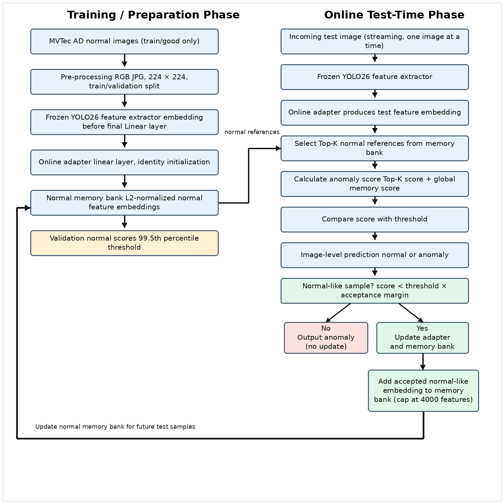

# Chapter 3: Research Methodology
## 3.1 Introduction
This chapter explains the methodology used to develop and evaluate the proposed online test-time learning method for industrial defect detection. The revised methodology is aligned with the current implementation notebook. The system uses normal training images to build a normal feature memory bank then processes test images one by one to simulate a streaming inspection environment.
The method does not retrain the full detection model during testing. Instead, a frozen YOLO26 classification model is used as a feature extractor while only a lightweight online adapter is updated when a test image is considered normal. This design keeps the method practical and reduces the risk of unstable model changes during operation.
The current experiment focuses on image-level anomaly detection using the MVTec AD dataset. Pixel-level anomaly mapping is treated as an optional extension and is not the main evaluation target of the present implementation. The methodology also considers how the workflow can be structured for a low-code environment where data preparation, inference, online updating and result monitoring can be organized as modular steps.

## 3.2 Research Design
This study follows an experimental research design and is implemented in a Python notebook on Kaggle using GPU acceleration. The experiment runs under a dual NVIDIA Tesla T4 GPU environment which supports efficient image processing, feature extraction, model inference and evaluation.
The research is designed to test whether online test-time learning can improve or maintain industrial anomaly detection performance during sequential testing. Instead of retraining the full YOLO-based model, the model is used as a frozen feature extractor. The extracted image features are then used to build a normal memory bank and to compare incoming test samples against normal reference patterns.
The experiment compares two settings. The first setting is the baseline method where test images are evaluated using the original feature representation without online adaptation. The second setting applies the proposed online test-time learning method where normal test samples are used to update the online adapter and expand the normal memory bank. The performance before and after adaptation is then compared using standard evaluation metrics.
The main stages of the experimental design are summarized in Table 3.1.

| Stage | Purpose | Implementation in Current Code |
|---|---|---|
| Data preparation | Prepare a clean dataset structure for anomaly detection. | MVTec AD images are converted into RGB JPG format and resized to 224 × 224.  Normal training data are split into training and validation sets. |
| Memory bank construction | Build a reference representation of normal samples. | Normal training images are passed through the frozen YOLO26 feature extractor and online adapter.  The resulting embeddings are stored as the normal memory bank. |
| Online test-time detection | Process incoming test images one by one. | Each test image is embedded and compared with Top-K normal reference features from the global memory bank to calculate an anomaly score. |
| Online adaptation | Update the system only when the sample appears normal. | If the score is below the accepted margin, the adapter is updated using consistency and anchor losses.  The new normal feature is added to the memory bank. |
| Evaluation | Measure the effect of online adaptation. | AUROC before and after adaptation, confusion matrix, precision, recall, F1-score, score distribution, and error cases are produced. |

*Table 3.1: Research design stages*

## 3.3 Overall System Architecture
The proposed system is designed as a two-phase architecture. The first phase is the training or preparation phase where normal images are used to form the initial normal memory bank. The second phase is the online test-time phase where each incoming image is compared with the stored normal features to decide whether it is normal or anomalous.
The system is modular. It consists of data input, feature extraction, online adapter, memory bank, anomaly scoring, online update and evaluation output. This modular structure is useful because the same workflow can later be transferred into a low-code platform. For example, data upload, feature extraction, threshold setting, test-time scoring and result dashboard can each be treated as separate workflow blocks.

images/figure-3-1-workflow.png 

**Figure 3.1: Proposed open-ended online test-time learning workflow**

## 3.4 Dataset and Data Preparation
Summaries the dataset information as below table 3.2.
Item	Description
Dataset	MVTec AD
Total images	5,354 images
Categories	15 categories: bottle, cable, capsule, carpet, grid, hazelnut, leather, metal nut, pill, screw, tile, toothbrush, transistor, wood, and zipper
Dataset structure	Training set contains normal images only; test set contains both normal and defective images
Training data	80% of original train/good normal images
Validation data	20% of original train/good normal images
Test normal data	Original test/good images
Test anomaly data	All original defect folders in the test set
Image format	RGB JPG
Image size	224 × 224 pixels
Data purpose	Training data builds the normal memory bank, validation data calibrates the threshold, test data evaluates normal and anomaly detection
Table 3.2: Dataset Preparation Summary

## 3.5 Feature Extraction using Frozen YOLO26
The current implementation uses the Ultralytics YOLO26 classification model as a frozen feature extractor. The model is not trained or fine-tuned in this experiment. Instead, the feature embedding is captured from the input to the final linear classification layer. This embedding is then L2-normalized before being used for anomaly scoring.
The use of a frozen feature extractor has two practical reasons. First, it reduces training cost because the full backbone does not need to be updated. Second, it lowers the risk of damaging previously learned general visual features during online adaptation. The adaptive part of the system is therefore limited to a lightweight adapter placed after the feature extractor.

## 3.6 Online Adapter and Normal Memory Bank
The online adapter is a simple linear projection layer with no bias. It has the same input and output feature dimension and it is initialized as an identity mapping. This means that at the beginning of the experiment the adapter does not change the extracted feature representation. During test-time adaptation, only this adapter is updated.
The memory bank stores feature embeddings extracted from normal training images. Each normal image is passed through the frozen YOLO26 feature extractor and the online adapter. The resulting normalized embeddings are stored as the initial normal representation. To prevent unlimited memory growth, the memory bank is capped at 4000 feature vectors in the current implementation.
The memory bank is central to the proposed method. Instead of training a classifier with labelled defect samples, the system compares a new test feature with stored normal features. A test image is considered more anomalous when its feature is less similar to the normal memory bank.

## 3.7 Threshold Calibration
The anomaly threshold is calibrated using validation normal images only. In the current code, validation scores are calculated by comparing validation normal embeddings with the normal memory bank. The threshold is then set at the 99.5th percentile of the validation normal scores. This setting is controlled by the parameter VAL_NORMAL_QUANTILE = 0.995.
Using only normal validation data avoids using defect labels to tune the threshold. This is consistent with the practical anomaly detection setting where labelled anomaly samples may be limited or unavailable. A test sample is predicted as anomalous when its anomaly score is equal to or higher than the calibrated threshold.

## 3.8 Open-Ended Anomaly Scoring
The improved version of the code uses an open-ended reference comparison strategy. For each incoming test image, the system first extracts a feature embedding and then compares it with the normal memory bank. Instead of using only the single nearest normal feature, the system selects the Top-K most similar normal reference features. In the current configuration, TOP_K_REFERENCES is set to 5.
The anomaly score combines two parts. The first part is the Top-K reference score which is based on the average similarity between the test feature and its Top-K normal references. The second part is the global memory-bank score which is based on the maximum similarity between the test feature and the full memory bank. The current implementation uses a reference weight of 0.7 and a global weight of 0.3. In simple terms, the score becomes higher when the test image is less similar to the stored normal patterns.
The scoring design is intended to make the comparison more stable. The Top-K references provide a local normal context while the global memory bank still checks the test feature against the wider normal distribution. This is useful for open-ended anomaly detection because not every normal image is expected to look exactly the same.

## 3.9 Online Test-Time Learning Procedure
The online test-time learning procedure is applied during testing. Test images are processed one by one to simulate a streaming inspection process. For each image, the system calculates an anomaly score before adaptation. This score is used to decide whether the sample is safe to use for online updating.
A sample is accepted for online updating only when it is normal. In the current code, this is controlled by the acceptance margin. The sample is accepted if its score is lower than the threshold multiplied by 0.95. This stricter condition helps reduce the risk of adding anomalous samples into the memory bank.
When a sample is accepted, the online adapter is updated using two losses. The first is a consistency loss which encourages the features of weakly and strongly augmented versions of the same image to remain close. The second is an anchor loss which keeps the accepted sample close to the average Top-K normal reference features. The YOLO feature extractor remains frozen during this update. After the adapter update, the updated embedding of the accepted sample is added into the memory bank as a new normal reference.
If the sample is not normal, it is rejected from the update process. The system outputs the anomaly result without changing the adapter or memory bank. This is important because updating on anomalous samples could contaminate the normal representation and reduce detection reliability.

## 3.10 Low-Code Implementation Consideration
The current implementation is written as a modular notebook prototype. Although the code is not yet a complete commercial low-code application, its structure is designed to support low-code conversion. Each major step can be represented as a separate block, including data preparation, feature extraction, memory bank construction, threshold calibration, anomaly scoring, online updating and result visualization.
This is relevant to the research title because the final target is not only to design an adaptive method but also to make the workflow easier for industrial users. In a low-code environment, engineers or quality control staff should be able to load images, select a model, run inspection, view anomaly scores and monitor updates without writing complex deep learning code. Therefore, the methodology considers both algorithm performance and practical usability.

## 3.11 Experimental Setup and Parameters
The experiment is carried out across all 15 MVTec AD categories. For each category, a separate memory bank, threshold and adapter are prepared. The test loader uses a batch size of one to simulate streaming test-time operation. This means the system receives one image, scores it, decides whether to update and then moves to the next image.

Parameter	Value	Purpose
Computing environment	Kaggle Notebook with GPU T4 × 2	Provides GPU acceleration for feature extraction, testing, and evaluation
Feature extractor	Frozen YOLO26 classification model	Extracts image feature embeddings without retraining the full model
Batch size	32 for preparation; 1 for online testing	Batch processing is used for preparation, while single-image testing simulates streaming operation
Online adapter	Linear layer initialized as identity	Acts as the only trainable component during test-time adaptation
Memory bank limit	4,000 feature vectors	Controls memory usage and prevents unlimited growth
Validation threshold	99.5th percentile of normal validation scores	Defines anomaly decision boundary without using defect labels
Top-K references	5	Selects the most similar normal reference features for local comparison
Reference/global score weights	0.7 / 0.3	Combines Top-K similarity and global memory-bank similarity
Online learning rate	1e-4	Controls the size of adapter updates
Online update steps	1	Limits the update amount for each accepted sample
Acceptance margin	0.95	Allows updates only for samples clearly below the anomaly threshold
Loss weights	Consistency = 1.0; Anchor = 0.1	Balances augmentation consistency and closeness to normal references
Table 3.3: Main experimental parameters used in the current implementation

## 3.12 Evaluation Metrics and Analysis
The system is evaluated using both score-based and classification-based metrics. AUROC is used to measure how well the anomaly scores separate normal and anomalous samples. The code records AUROC before and after online test-time learning so that the effect of adaptation can be observed.
After applying the threshold, the system also produces image-level predictions. The confusion matrix is used to show the number of correct and incorrect predictions for normal and anomalous samples. Precision, recall and F1-score are calculated for both classes. These metrics are important because defect detection must balance two risks which the missing real defects and wrongly rejecting normal products.
Additional visual analysis is included in the code. Score distributions are plotted to show how normal and anomaly scores are separated after adaptation. False positives and false negatives are also displayed for one selected category. This helps identify the types of cases where the model still makes mistakes.

## 3.13 Summary
This chapter presented the revised methodology for the proposed online test-time learning method. The current implementation uses MVTec AD as the evaluation dataset, YOLO26 as a frozen feature extractor, an identity-initialized online adapter as the adaptive component and a normal memory bank as the reference representation.
The improved workflow compares each incoming test image with Top-K normal references and the full memory bank to calculate an anomaly score. Only normal samples are used to update the adapter and memory bank. This design allows the system to adapt gradually during operation while reducing the risk of anomaly contamination.
The methodology is aligned with the current code and focuses on image-level anomaly detection. It also keeps the workflow modular so that it can be developed further into a low-code system for practical industrial inspection use.
